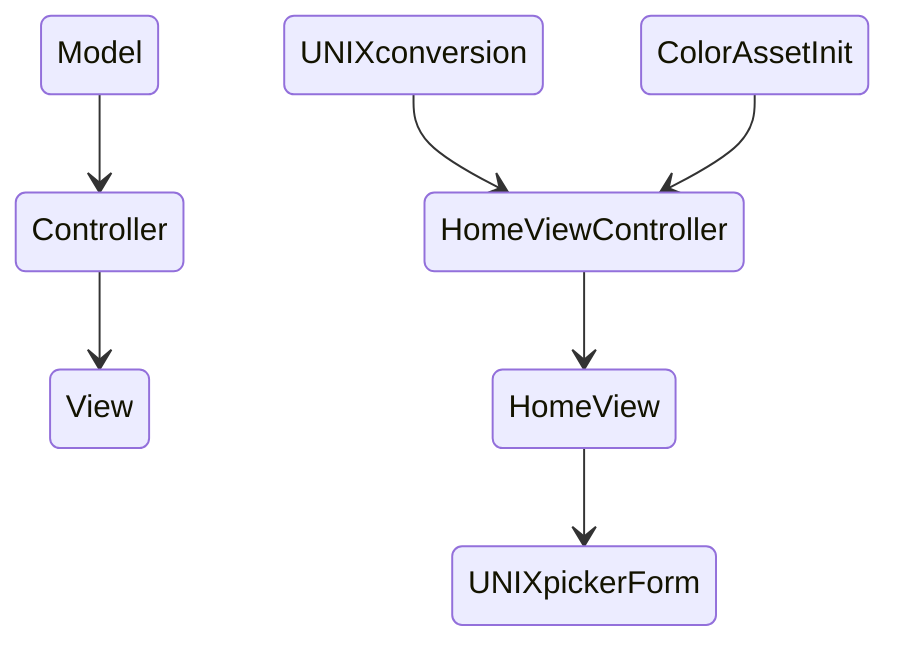

<p align= "center">

</p>
 
# Contents

- [Contents](#contents)
  - [Description of Application](#description-of-application)
  - [Key Features](#key-features)
  - [Understanding the UI](#understanding-the-ui)
  - [Design](#design)
  - [UNIX Convertion (model)](#unix-convertion-model)
  - [ColorAssetInit(model)](#colorassetinitmodel)
    - [Home View](#home-view)
  - [Home View Controller](#home-view-controller)

## Description of Application

Discord Date & Time uses UNIX time to display an acurate timestamp that coensides with the viewer's timezone. It works by distinguishing the amount of seconds past or need to pass from 1 January, 1970. 

Discord's backend has logic that is built to immediately convert seconds into a formatted date-time group assuming that it is encompassed in Discord UNIX formatting `<t:00000000:f>` for example. This will display a date-time foramt of `01 January, 1970` or `January 01, 1970` in US date-time formatting. Your timezone will determine whether Discord displays US or EU format.

The app currently outputs UNIX time in:

- Long date & Time: EU `01 January 1970 0000` US `January 01 1970 12:00 AM`
- Day, Date & Time: EU `Thursday, 01 January 1970 0000` US `Thurday, January 01 1970 1200 AM`
- Short Date: EU `01 January 1970` US `January 01 1970`
- Abbreviated Date EU `dd/MM/yyyy` US `MM/dd/yyyy`  
- Just Time: EU `0000` US `1200 AM`
- Relative Time: Event starts `in 10 hours` or started `10 hours ago`

## Key Features

The key feature of the app is the ability to convert a date into a discord-friendly UNIX timestamp so that users can notify community members of event timings regardless of their timezone.

DDT offers multiply time formatting and can be produced in seconds without any extra typing or adjustment. 

The copy button utilises the user's device clipboard to ensure the timestamp is available to all assets on the device, in particular, Discord.

## Understanding the UI

The User Interface (UI) is a simple view separated into six formatting types. Each type is destinguished by a heading, date picker, and two buttons - on top of a grey rectangle. The forms are loacated in a Scroll View.

A help button is located on the bottom left of the screen.

<p align="center">s


</p>

The help button leads to the help view which answers questions that may arise. Currently, that help view is text-based and could seem boring to read. 


<p align="center">


</p>

Future improvements could lead to video tutorials or diagrams.

## Design

The App is designed using the Model-View-Controller pattern.



## UNIX Convertion (model)

This is a simple date-time to UNIX conversion that is build into the swift Foundation SDK. It converts a date object into a time interval Double. This is the amount of seconds to that point in time - Whether that be in the past, present, or future.

```swift
  let unixTime = date.timeIntervalSince1970.rounded()
```

This action is executed by the `convertToEpoch()` method, which returns a string. Therefore, the `Double` variable is parsed to a `String` before it is returned.

```swift
import Foundation

class UNIXconvertion : ObservableObject {
       
    // converts the date-time variable into epoch/UNIX time stamp and returns it as a string.
    // type casts the Double to a string so there is no decimal. This creates an output without milliseconds. 
    func convertToEpoch(date: Date) -> String{
        
        let unixTime = date.timeIntervalSince1970.rounded()
        
        let unixFormatted = String(Int(unixTime))
        
        return unixFormatted
        
    }
}
```

## ColorAssetInit(model)

This is a simple colour initialisation. It is the background colour for the form. The extension allows the color asset `formGrey` to be accessed by the type `Color`.

```swift
import Foundation
import SwiftUI

// background colour for each VStack, creating a Form-like look.
// Form was not used as it has massive padding that I cannot manipulate.
extension Color {
    static let formGrey = Color("Color.formGrey")
}
```

### Home View

This is the main view of the app. I holds the scrolling view with each form abstacted from the UNIXpickerForm view. This minimises the replication of code.
A single form is initialised with arguments:

- controller object.
- a string tag for identification.
- a string heading.
- a string subheading.
  
```swift
UNIXpickerForm(controller: HomeViewController, tag: String, heading: String, subHeading: String)
```

This drastically lowers the lines of code within the HomeView file.

```swift
import SwiftUI


struct HomeView: View {
    
    
    // instance of the controller for this view.
    @ObservedObject var controller = HomeViewController()
    	
    
    var body: some View {
        NavigationView {
            ZStack {
                
                ScrollView {
                    
                    UNIXpickerForm(controller: controller, tag: "long", heading: "Long Date & Time", subHeading: "eg: Mission step off 01 January, 2024 9:01 AM")
                    UNIXpickerForm(controller: controller, tag: "dayDateTime", heading: "Day, Date & Time", subHeading: "eg: Wednesday, January 01 2024 9:01 AM")
                    UNIXpickerForm(controller: controller, tag: "short", heading: "Short Date", subHeading: "eg: Mission is on 01 January, 2024")
                    UNIXpickerForm(controller: controller, tag: "abb", heading: "Abbreviated Date", subHeading: "eg: Mission is on the 01/01/2024")
                    UNIXpickerForm(controller: controller, tag: "tShort", heading: "Just Time", subHeading: "eg: Misson is at 10:00 AM")
                    UNIXpickerForm(controller: controller, tag: "rel", heading: "Relative Time", subHeading: "eg: 3 hours until mission starts")
                }
                .navigationTitle("Discord Date & Time")
                .navigationBarTitleDisplayMode(.large)
                
                NavigationLink(destination: HelpView()) {
                    Image(systemName: "questionmark.circle.fill")
                        .resizable()
                        .frame(width: 70, height: 70)
                        .foregroundColor(.blue)
                        .shadow(radius: 10)
                    
                }.offset(x: -140, y: 270)
                
            }
            
        }// end of ScrollView
        
            
            
        }// some View
 }

```

## Home View Controller

```swift
// Attibutes
    @Published var date = Date()
    @Published var epochTimeLong = String()
    @Published var epochTimeShort = String()
    @Published var epochTimeAbb = String()
    @Published var epochTimeRel = String()
    @Published var epochTimeTimeShort = String()
    @Published var epochTimeDayDateTime = String()
    let model = UNIXconvertion()
```

The `HomeViewController` class has two methods. `setEpoch` and `copyToClipboard`. The class also hold a string variable for each format type. Originally, there was only one, but this caused all TextFields to update to any apply button pressed instead of jsut the one beside that button. To fix this, each format type was given it's own string var.

The model object is initilised as a const as no changes are made to the object.

The `setEpoch` method takes in a single string argument and uses it to determine which switch case to execute and return.
The `date` attribute is updated via state management.

```swift
 func setEpoch(tag:String)->String {
        
        switch tag {
        case "long":
            self.epochTimeLong = "<t:\(self.model.convertToEpoch(date: self.date)):f>"
            return self.epochTimeLong
        case "short":
            self.epochTimeShort = "<t:\(self.model.convertToEpoch(date: self.date)):D>"
            return self.epochTimeShort
        case "abb":
            self.epochTimeAbb = "<t:\(self.model.convertToEpoch(date: self.date)):d>"
            return self.epochTimeAbb
        case "rel":
            self.epochTimeRel = "<t:\(self.model.convertToEpoch(date: self.date)):R>"
            return self.epochTimeRel
        case "tShort":
            self.epochTimeTimeShort = "<t:\(self.model.convertToEpoch(date: self.date)):t>"
            return self.epochTimeTimeShort
        case "dayDateTime":
            self.epochTimeDayDateTime = "<t:\(self.model.convertToEpoch(date: self.date)):F>"
            return self.epochTimeDayDateTime
        default:
            self.epochTimeLong = "#ERROR"
            return self.epochTimeLong 
        }
    }
```

The `copyToClipboard` method uses Foundation functionality to copy the string to the device's Clipboard. This allows the string to be pasted into other applications, like Discord. It takes the same string argument as the other method and uses it to determine wich attribute to copy to the device.

```swift
   func copyToClipboard(tag:String) {
        
        switch tag {
        case "long":
            UIPasteboard.general.string = epochTimeLong
        case "short":
            UIPasteboard.general.string = epochTimeShort
        case "abb":
            UIPasteboard.general.string = epochTimeAbb
        case "rel":
            UIPasteboard.general.string = epochTimeRel
        case "tShort":
            UIPasteboard.general.string = epochTimeTimeShort
        case "dayDateTime":
            UIPasteboard.general.string = epochTimeDayDateTime
        default:
            UIPasteboard.general.string = "#ERROR IN PASTE"
        }
    }

```
